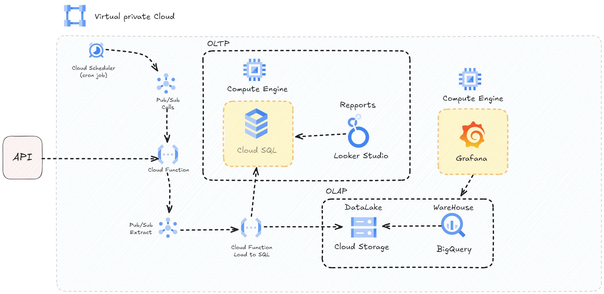

# GCP Native Project Pipeline

This project is the first in a series that demonstrates how to build a fully native pipeline using various Google Cloud services to design a robust, scalable data platform. By leveraging the power of GCP’s serverless and managed services, you'll learn how to integrate, process, and visualize data efficiently.



## Services Used

1. **Cloud Scheduler**  
   Trigger and manage scheduled jobs for automation.

2. **Cloud Pub/Sub**  
   Message queue for real-time data integration.

3. **Cloud Functions**  
   Event-driven serverless compute for running microservices.

4. **Cloud SQL**  
   Managed relational database service using MySQL.

5. **Looker Studio**
   Data visualization and reporting for creating real-time dashboards.

6. **Cloud Storage**  
   Scalable object storage for data files and assets.

7. **BigQuery**  
   Fully managed data warehouse for analytics.

8. **Looker Studio**
   Previously known as Google Data Studio, is a powerful data visualization and BI tool.

9. **VPC Network**  
   Isolated network infrastructure for managing resources securely.

10. **IAM & Admin**  
    Identity and access management for securing and managing permissions.

11. **Logging**  
    Centralized logging using Google Cloud Logging for monitoring application performance.

12. **Monitoring**  
    Provides powerful tools for tracking the performance, health, and reliability of your applications and infrastructure

## Key Features

- **GCP Native Services**: Fully leverages services such as Cloud Pub/Sub, Cloud Functions, BigQuery, Cloud SQL, and more.
- **Pub/Sub Architecture**: Designed with a Pub/Sub messaging system to enable reliable, real-time data integration.
- **Serverless Streaming Pipeline**: Serverless functions provide a scalable, cost-efficient pipeline for processing and streaming data.
- **Seamless Data Visualization**: Data is visualized through Looker Studio, bringing insights to life with minimal effort.
- **Logging and Monitoring**: Implement robust logging and monitoring practices with Cloud Logging and Cloud Monitoring.

## Project Overview

This project focuses on building a data pipeline using **Cloud Functions**, **Cloud SQL**, and other GCP services. We aim to connect and orchestrate services to ingest, store, and visualize data using modern, serverless technologies.

In this project, we use two types of pipelines: OLTP (Online Transaction Processing) and OLAP (Online Analytical Processing), both of which play crucial roles in handling and processing cryptocurrency data obtained from the CoinMarketCap API.

The API provides real-time data on cryptocurrency market conditions, such as price, market cap, and volume for coins like Bitcoin. Our pipelines are designed to process this data for both transactional needs and analytics.

### OLTP Pipeline

The OLTP pipeline handles real-time cryptocurrency data from the CoinMarketCap API. It ingests the latest prices, market volume, and supply information and stores them for immediate use in transactional systems.

Key features of the OLTP pipeline include:

Real-time updates: Fetches live data from the API, such as Bitcoin's price, volume, and market cap.
Transactional integrity: Ensures that incoming data is quickly and accurately stored for operational use.
Cloud SQL: Used as the relational database to store the real-time data, enabling fast updates and low-latency reads.
For example, in the OLTP pipeline, data like the current price of Bitcoin ($63,611) and its market cap ($1.26 trillion) are stored in Cloud SQL and updated frequently. This data can be used in applications that require up-to-the-minute information on market conditions.

Key components of the OLTP pipeline:

Cloud Scheduler: Triggers API calls to fetch cryptocurrency data at scheduled intervals.
Cloud Pub/Sub: Acts as the message broker to deliver the fetched data to the database.
Cloud Functions: Event-driven functions process and store the data into Cloud SQL.
Cloud SQL: Stores transactional data like current prices, market volumes, and supply numbers.

### OLAP Pipeline

The OLAP pipeline is designed for batch processing and analytics. It takes the cryptocurrency data stored in Cloud SQL and processes it in bulk for advanced insights, historical analysis, and business intelligence reporting.

Key features of the OLAP pipeline include:

Historical data analysis: Aggregates and processes historical market data, such as trends over the past 30, 60, and 90 days.
Complex queries: Used to calculate long-term trends, market dominance, and performance metrics over time.
BigQuery: As the data warehouse, it allows for fast querying and processing of large datasets, such as the change in Bitcoin's price over 90 days (+11.38%).
For example, in the OLAP pipeline, data such as the percent change in Bitcoin price over 1 hour (-0.11%) or 30 days (+17.24%) is analyzed to provide insights into market trends. The data is then visualized using Looker Studio for real-time and historical analysis.

Key components of the OLAP pipeline:

Cloud Storage: Stores historical market data for processing.
BigQuery: Performs large-scale analytical queries to track trends, such as market cap dominance and price fluctuations over different time frames.
Looker Studio: Used to build dashboards for monitoring the state of the cryptocurrency market, helping visualize both real-time data and historical trends.

Example Use Cases

OLTP: Use the OLTP pipeline to update your application with the latest cryptocurrency prices, volumes, and supply from the CoinMarketCap API. This allows users to view real-time market data such as the Bitcoin price and market cap.

OLAP: Use the OLAP pipeline to generate reports and dashboards showing historical trends. For instance, users can analyze the percent change in Bitcoin price over 7 days (-1.38%) or compare it against other cryptocurrencies for long-term investment strategies.

## Connecting Cloud SQL to Local Environment

After setting up **Cloud SQL** (MySQL) on a **Compute Engine**, you may want to connect from your predilected IDE, in my case the most common one: Visual Studio Code. Follow the steps below to configure the required permissions.

### Steps to Set Up Permissions

#### 1. Enable Cloud SQL Admin API

Make sure the **Cloud SQL Admin API** is enabled for your project. You can enable it by:

1. Navigating to the Google Cloud Console API Library.
2. Searching for "Cloud SQL Admin API."
3. Clicking "Enable" on the API page.

#### 2. Grant Cloud SQL Client Role

Ensure your service account has the appropriate permissions to connect to Cloud SQL.

1. Go to the **IAM & Admin Console**.
2. Find the service account associated with your `key_access_sql.json`.
3. Click the pencil icon to edit the roles for this service account.
4. Add the **Cloud SQL Client** role (`roles/cloudsql.client`).

> This role allows the service account to connect to Cloud SQL instances.

#### 3. (Optional) Additional IAM Roles

For administrative tasks, you might need to add the following roles:

- **Cloud SQL Admin** (`roles/cloudsql.admin`): Full management access to Cloud SQL resources.
- **Cloud SQL Viewer** (`roles/cloudsql.viewer`): Read-only access to Cloud SQL resources.

#### 4. Verify Service Account Key

Ensure the service account JSON key you're using (`key_access_sql.json`) has the correct permissions. Verify the roles of this service account by reviewing its permissions in the **IAM & Admin Console**.

#### 5. Check GCP Billing

Make sure your GCP project is linked to an active billing account to avoid any restrictions on API usage.

---

## How to Run

1. Clone this repository:
   ```bash
   git clone -b 01-GCP-Native https://github.com/JaviPSanchez/GCP_Templates.git .
   ```
2. Navigate to the specific project directory:

   ```bash
   cd GCP_Templates/01-GCP-Native
   ```

3. Follow the steps outlined in the documentation to set up the GCP services for this project.

---

## Future Enhancements

- Integration with **Cloud Run** for containerized workloads.
- Expansion of the pipeline with **Airflow** for complex orchestration.
- Application of **BigQuery ML** for machine learning predictions directly in the data warehouse.

---

Feel free to contribute to this project by opening issues or submitting pull requests. Let's build scalable, serverless data solutions on GCP together!
