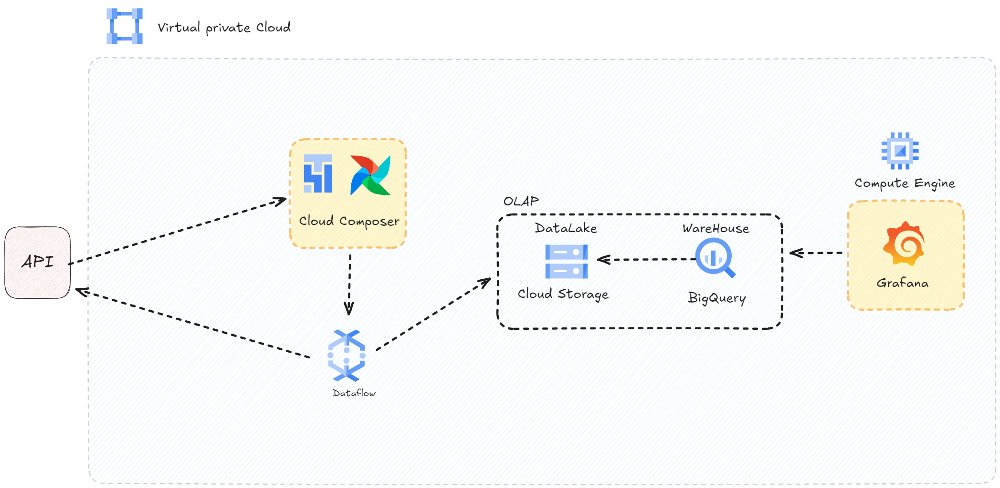
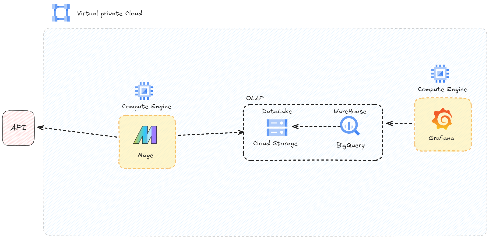

# [Google Cloud Platform - Projects](https://atalaya.digital)

## Project Details

- **Title:** [Atalaya Digital - Data Solutions](https://atalaya.digital)
- **Sub Title:** Start your Google Cloud Journey with 3 practical demos.

## Instructions

select you desired branch and clone it

👉 git clone branch .

## Google Platform Projects: 3 Practical Demos

### First Project

1.  Cloud Scheduler
2.  Cloud Pub/Sub
3.  Cloud Functions
4.  Cloud SQL
5.  Looker Studio
6.  Cloud Storage
7.  BigQuery
8.  Grafana
9.  VPC Network
10. IAM & Admin

### Second Project

1.  Cloud Composer - Airflow
2.  Cloud Dataflow
3.  Looker Studio
4.  Cloud Storage
5.  BigQuery
6.  VPC Network
7.  IAM & Admin

### Third Project

1.  Mage
2.  Grafana
3.  Cloud Storage
4.  BigQuery
5.  Grafana
6.  VPC Network
7.  IAM & Admin
